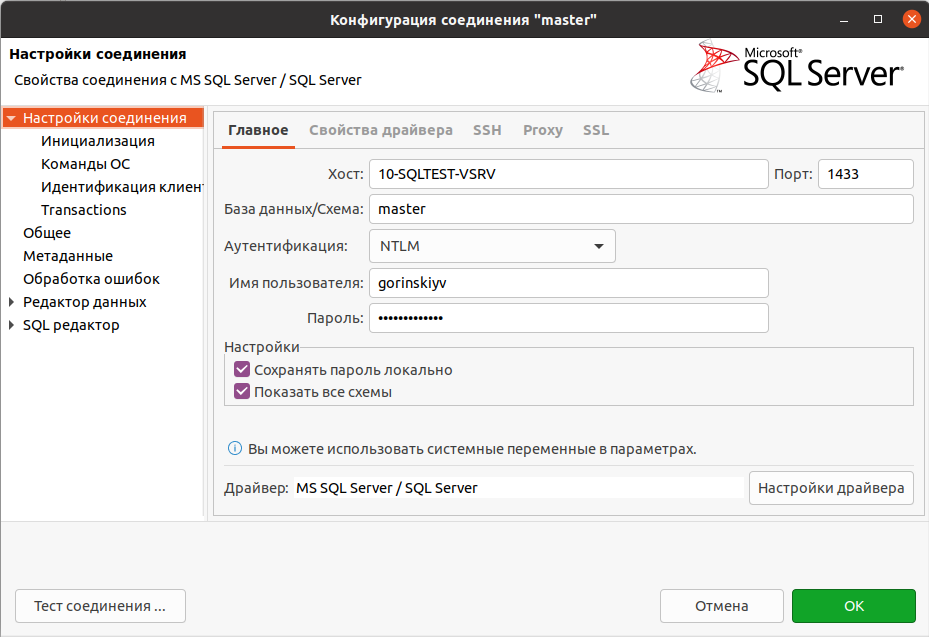

# mssql_to_postgres

## Что умеет этот инструмент:
* Создаёт схемы аналогично схемам в Microsoft SQL Serve
* Создает таблицы аналогично таблицам в Microsoft SQL Serve, меняя типы данных с Microsoft SQL Serve на типы данных в Postgres
* Переносит данные

### Подготовка:
Для работы скриптов нужен python3, tdsodbc, unixodbc-dev, libpq-dev и python библиотеки: pyodbc, psycopg2

#### pyodbc
```
apt install tdsodbc
apt install unixodbc-dev
pip install pyodbc
```
Настройка ODBC:
```
cat /etc/odbcinst.ini
[FreeTDS]
Description = TDS driver (Sybase/MS SQL)
Driver = /usr/lib/x86_64-linux-gnu/odbc/libtdsodbc.so
#Setup = /usr/lib/odbc/libtdsS.so
CPTimeout =
CPReuse =
```

#### psycopg2
```
apt install libpq-dev
pip install psycopg2
```

### Описание:
Данный инструмент не создает базу данных в Postgres, не знаю почему я не стал это реализовывать, возможно я считаю, что лучше самостоятельно создать базу данных с нужными правами заранее.
Все переносятся только схемы со всеми таблицами и данными. Не переносятся процедуры 

### Настройка:
Все настройки производятся в файле config.py.  
Я думаю не должно возникнуть вопросов к нему, но на всяких случай:

##### Microsoft SQL Serve

* ms_database  ==> Имя базы данных
* ms_server ==> Адрес сервера, указывается в формате 'ip,port'
* ms_username ==> Имя пользователя для подключения к базе данных (не доменная авторизация. Картинка ниже как подсказка.)  
  
* ms_password ===> Пароль пользователя для подключения к базе данных
* odbc_driver ==> Тот самый 'Driver', который указывается в файле '/etc/odbcinst.ini'
* ignore_schemas ==> Список схем, которые будем пропускать
* ignore_tables ==> Список таблиц, которые будем пропускать


##### Postgres
* pg_database ==> Имя базы данных, указываем 'ms_database', чтоб использовать базу с аналогичным именем.
* pg_username ==> Имя пользователя для подключения к базе данных
* pg_password ==>  Пароль пользователя для подключения к базе данных
* pg_server   ==> Адрес сервера

# Settings
* drop_tables ==> Надо удалять таблицы перед их созданием?
* pull ==> Размер записей, котрые за раз будем закидывать в Postgres

### Ссылки
Для сопоставления типов данных я руководствовался этими ссылками:
* [sqlines.com](https://www.sqlines.com/sql-server-to-postgresql)
* [severalnines.com](https://severalnines.com/database-blog/migrating-mssql-postgresql-what-you-should-know )
##### Но я обнаружил несоответствие:
* Тип данных в Microsoft SQL Server 'uniqueidentifier' должен соответствовать 'CHAR(16)' в Postgres, но это не так, ему соответствует 'UUID'.

Документацию для pyodbc я смотрел [тут](https://code.google.com/archive/p/pyodbc/wikis/Cursor.wiki), но это архив, наверно правильнее будет руководствоваться [оффициальным маном](https://github.com/mkleehammer/pyodbc/wiki/Cursor).

Но мне было достаточно того, что columns состоит из:
* table_cat
* table_schem
* table_name
* column_name
* data_type
* type_name
* column_size
* buffer_length
* decimal_digits
* num_prec_radix
* nullable
* remarks
* column_def
* sql_data_type
* sql_datetime_sub
* char_octet_length
* ordinal_position
* is_nullable: One of SQL_NULLABLE, SQL_NO_NULLS, SQL_NULLS_UNKNOWN.

Это используется в функции 'get_MStoPG_columns()', где:
|get_MStoPG_columns()|Документация|
|-------------|----------|
|column[3]|column_name|
|column[5]|type_nam|
|column[6]|column_size|
|column[8]|decimal_digits|
|column[17]|is_nullable|


